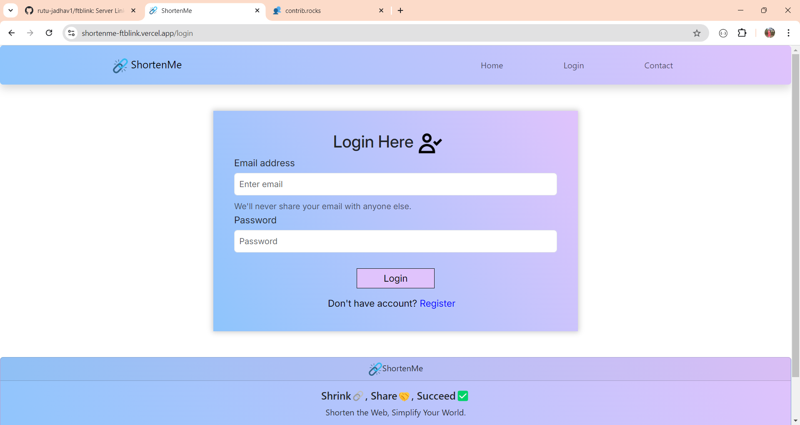
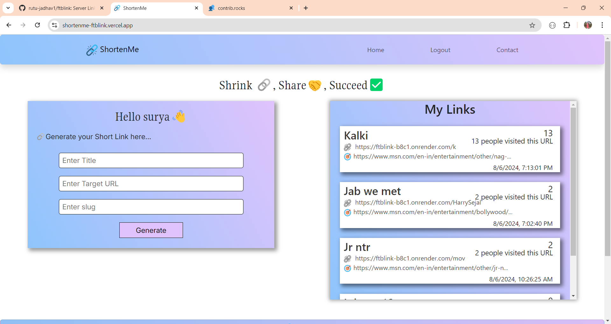

# Project-Name: ShortenMe - URL Shortner Web

---
# Project-Title:  ShortenMe

## Introduction
This turns long web addresses into short, neat links that are easier to share, especially on social media or in text messages.

---
## Features
1. Looks Better : Shortened links look cleaner and are more attractive, which is great for marketing and professional communication.
2. Tracking : It helps you see how many times people click on your link and where they're clicking from. This is useful for understanding how well your links are doing.
3. Prevents Errors : Short links are less likely to break or get messed up when shared, which helps ensure that people can always access your content.

---
### Login Page

---
### User Page

---
## Technologies Used
- React.js : A JavaScript library for building user interfaces.
- MongoDB : MongoDB used to manage and store both link database and user data. MongoDB is a NoSQL database that allows for flexible and scalable data management.
- HTML5 & CSS3 : Markup and styling languages for building web pages.
- JavaScript : A programming language for adding interactivity to web applications.
- Style-Components : A CSS framework for creating responsive and mobile-first designs.
- Git : A version control system for tracking changes and collaborating on projects.
- Cron-Job : A cron job is like a timer for your computer. It runs specific tasks or commands automatically at set times.
---
## Installation
To run this portfolio locally, follow these steps:

1. Clone the repository: `git clone https://github.com/rutu-jadhav1/ftblink.git`
2. Navigate to the project directory: `cd ftblink`
3. Install the dependencies: `npm install`
4. Start the development server: `npm start`
5. Open your browser and visit: `http://localhost:3000`
---
## How to Contribute 🪴💻

We welcome contributions from the community to help us expand and improve this handbook if you would like to contribute follow the steps:

1. Fork the repository to your GitHub account.
2. Make your changes ,add new content or fix the existing issues.
3. Open pull request in this repository.
---
## Contributors

Made with [contrib.rocks](https://contrib.rocks).
